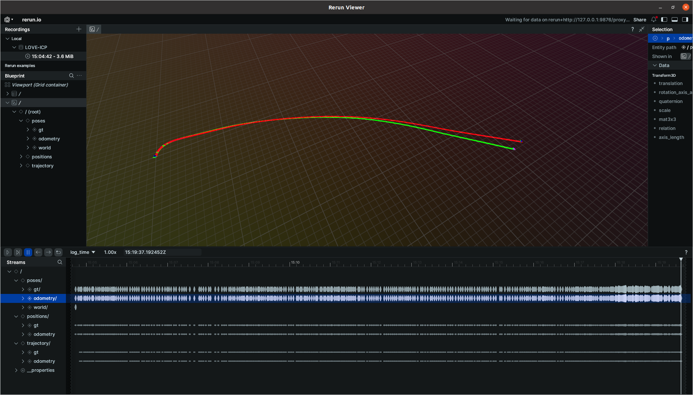

# LiDAR SLAM in C++

## Intro
This project focuses on implementing a LiDAR-based SLAM system in C++.  

The odometry module has already been implemented, and the next steps involve adding LiDAR-based loop closure detection and pose graph optimization.  

In the future, I plan to integrate GNSS, IMU, and camera data, fusing them within a factor-graph-based framework.  

For visualization, I use [ReRun](https://www.rerun.io), which provides a convenient and smooth interface. 

## Instalation
TODO

## Usage
TODO

## Contributing
Contributions are welcome!  
Feel free to suggest improvements to the odometry pipeline or ideas on improving the efficiency of the C++ implementation.

## Visualizer

## Inspiration
TODO
